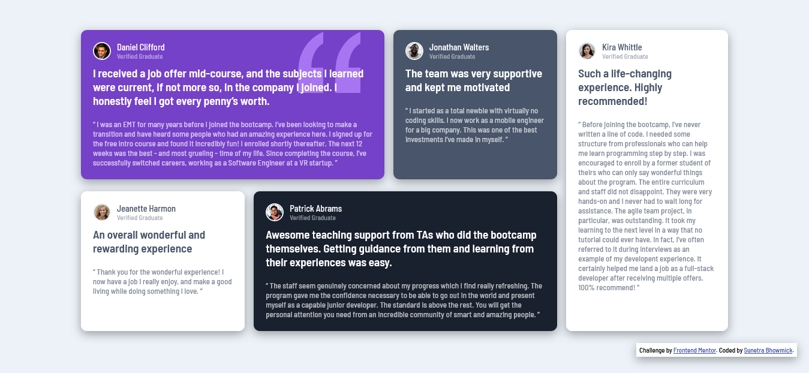

# Frontend Mentor - Testimonials grid section solution

This is a solution to the [Testimonials grid section challenge on Frontend Mentor](https://www.frontendmentor.io/challenges/testimonials-grid-section-Nnw6J7Un7). Frontend Mentor challenges help you improve your coding skills by building realistic projects. 

## Table of contents

- [Overview](#overview)
  - [The challenge](#the-challenge)
  - [Screenshot](#screenshot)
  - [Links](#links)
- [My process](#my-process)
  - [Built with](#built-with)
  - [What I learned](#what-i-learned)
  - [Continued development](#continued-development)
  - [Useful resources](#useful-resources)
- [Author](#author)
- [Acknowledgments](#acknowledgments)

## Overview

### The challenge

Users should be able to:

- View the optimal layout for the site depending on their device's screen size (mobile or desktop device)

### Screenshot

### Links

- Solution URL: [GitHub Repository](https://github.com/kaiser-sb/testimonial-grid-section)
- Live Site URL: [Testimonial grid section](https://kaiser-sb.github.io/testimonial-grid-section/)

## My process

### Built with

- Semantic HTML5 markup
- CSS
- Flexbox
- Mobile-first workflow
- Responsive design

### What I learned

While building this project, I refined my skills on using Flexbox to attain the required design. I revisited the concepts of `flex-grow`, `flex-shrink`, `flex-basis` and designed the project using Mobile-first approach.

### Continued development

While I am getting comfortable using Flexbox, I am planning to learn CSS Grid and apply the knowledge in building future projects. Also, I have built this for mobile and desktop/ laptop but have not introduced any special breakpoint for large screen mobile devices like tablets.

### Useful resources

- [Guide to CSS Flexbox](https://css-tricks.com/snippets/css/a-guide-to-flexbox/) - This is an awesome article to learn Flexbox concepts and visually see how each property is displayed depending on the value set.

- [W3Schools](https://www.w3schools.com/css/css3_flexbox.asp) - This is an amazing resource and I'd recommend it to anyone still learning this concept.

## Author

- LinkedIn - [Sunetra Bhowmick](https://www.linkedin.com/in/kaiser-sb/)
- Frontend Mentor - [@kaiser-sb](https://www.frontendmentor.io/profile/kaiser-sb)
- GitHub - [@kaiser-sb](https://github.com/kaiser-sb)

## Acknowledgments

I have been following [Zach Gollwitzer](https://github.com/zachgoll) and his [Frontend Web Development Bootcamp](https://youtu.be/zJSY8tbf_ys?si=fcT5sk2CtCLrb9tJ) course has helped me immensly to brush up lots of key concepts and boost my confidence on building projects on my own. He gave a complete walkthrough of this challenge in his video and I have followed the same with some of my own modifications. Do check out his YouTube channel and GitHub page.
